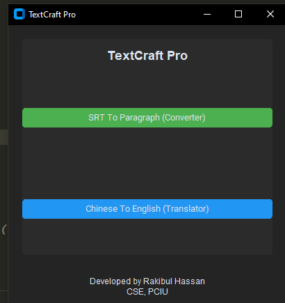

TextCraft Pro
A powerful SRT to Word conversion tool that makes subtitle formatting effortless. TextCraft Pro enables batch processing, customization, and seamless conversion to Word documents, all within an intuitive GUI.

Features
Batch File Conversion: Convert multiple SRT files in one session.
Custom Headings: Add personalized headings to your Word documents.
Character Limit Control: Define maximum characters per paragraph for precise formatting.
Live Status Updates: Track the number of selected and processed files in real time.
User-Friendly Interface: Modern design with light/dark mode for enhanced usability.
Error Logging: Detailed logs to help troubleshoot issues quickly.

Installation
Clone the repository to your local machine:
git clone https://github.com/Rakibul-Hassan-1/TextCraft-Pro.git

Navigate to the project directory:
cd TextCraft-Pro

Install the required Python libraries:
pip install -r requirements.txt

Running the App
To run TextCraft Pro, simply execute the following command in your terminal:

python main.py

How to Use
Launch the App: Run the main.py file to open the GUI.

Select Files: Click Browse to choose one or more SRT files. The app will display the number of selected files.

Customize Settings (Optional):
Enter a custom heading for the Word documents.
Specify a maximum character limit per paragraph.
Choose Output Folder: Select a folder to save the converted Word documents.

Convert: Click Convert to Word and watch the progress updates in real time.
Screenshots

Development
Built With:
Python 3.9.6
customtkinter for the GUI
python-docx for Word document generation
Contributing
Contributions are welcome! Please follow these steps:

Fork the repository.
Create a new branch:
git checkout -b feature/YourFeatureName

Commit your changes:
git commit -m "Add some feature"

Push to the branch:
git push origin feature/YourFeatureName

Open a pull request.

License
This project is licensed under the MIT License. See the LICENSE file for details.

Support
If you encounter any issues, feel free to open an issue in the repository or contact Rakibul Hassan at your-email@example.com.

Crafted with ❤️ by Rakibul Hassan
Streamlining your text conversion workflow.
