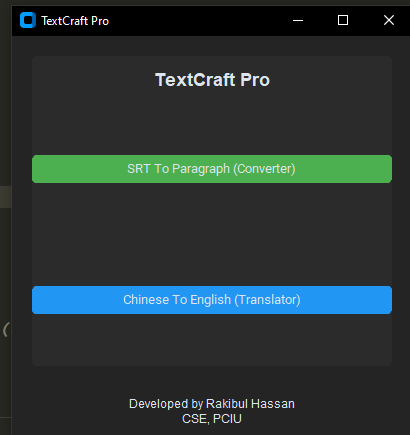
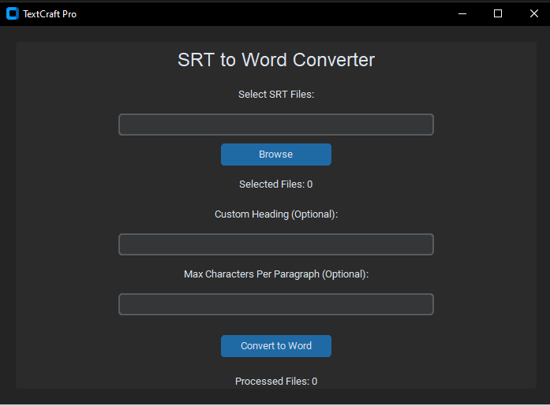
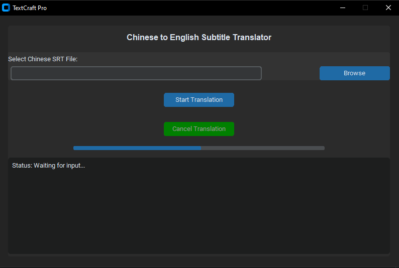

# **TextCraft Pro**

_A powerful SRT to Word conversion tool that simplifies subtitle formatting effortlessly._

---

## **Features**

- 🛠️ **Batch File Conversion**: Process multiple SRT files in one session.
- 🖋️ **Custom Headings**: Add personalized headings to your Word documents.
- 📏 **Character Limit Control**: Define maximum characters per paragraph for precise formatting.
- 📊 **Real-Time Status Updates**: Track the number of selected and processed files.
- 🌟 **Modern User Interface**: Sleek design with light/dark mode options.

---

## **Installation**

1. **Clone the repository** to your local machine:
   ```bash
   git clone https://github.com/Rakibul-Hassan-1/TextCraft-Pro.git
   ```
2. **Navigate to the project directory**:
   ```bash
   cd TextCraft-Pro
   ```
3. **Install required dependencies**:
   ```bash
   pip install -r requirements.txt
   ```

---

## **How to Run**

Run **TextCraft Pro** by executing this command in your terminal:

```bash
python main.py
```

---

## **How to Use**

1. **Launch the App**: Run the `main.py` file to open the GUI.
2. **Select Files**:
   - Click **Browse** to choose one or more SRT files.
   - The app will display the total number of selected files.
3. **Customize Settings** _(Optional)_:
   - Add a custom heading for the Word documents.
   - Specify a maximum character limit per paragraph.
4. **Choose Output Folder**: Select where you want to save the converted Word documents.
5. **Convert**:
   - Click **Convert to Word**.
   - Real-time progress updates will show the number of files processed successfully.

---

## **Screenshots**

__
__
__

---

## **Development**

- **Built With**:
  - `Python 3.9.6`
  - `customtkinter` for the modern GUI
  - `python-docx` for Word document generation

---

## **Contributing**

Contributions are welcome! Follow these steps to contribute:

1. **Fork the repository**.
2. **Create a new branch**:
   ```bash
   git checkout -b feature/YourFeatureName
   ```
3. **Commit your changes**:
   ```bash
   git commit -m "Add some feature"
   ```
4. **Push the branch**:
   ```bash
   git push origin feature/YourFeatureName
   ```
5. **Open a pull request**.

---

## **License**

This project is licensed under the MIT License. See the [LICENSE](LICENSE) file for details.

---

## **Support**

If you encounter any issues, feel free to:

- Open an issue in the repository.
- Contact **Rakibul Hassan** at **rakibulhassan29052000@gmail.com**.

---

### ✨ Developed by Rakibul Hassan

_"Streamlining your text conversion workflow effortlessly!"_
